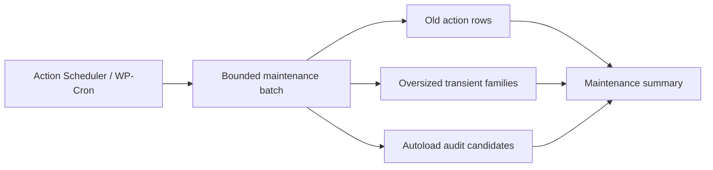

# A2 WooCommerce Performance Lab

Public-safe engineering case study for WooCommerce performance work around cache boundaries, REST pressure, Action Scheduler cleanup, transient growth, autoload hygiene, and production diagnostics.

This repository is a curated showcase. It is not a production source dump.

## Reviewer Shortcut

This repo demonstrates production-minded WooCommerce performance engineering through public-safe documentation and sanitized sample patterns. It relates to stores where slow PDPs, archive pages, REST routes, scheduler backlog, and transient growth create operational pressure. It proves request classification, cache boundaries, REST pressure control, queue cleanup, and observability. Start with `docs/infrastructure`, `docs/engineering-notes`, and `samples/infrastructure`. This is a showcase repository, not a production package.

## Overview

The work represented here focuses on WooCommerce stores where performance problems were not isolated to one slow page. The system had several pressure points at the same time: Elementor-heavy product pages, slow archive filters, anonymous REST traffic, background queue buildup, transient table growth, and admin instability.

## Production Context

- Live WooCommerce catalog with product detail pages, archives, cart, checkout, admin workflows, and third-party plugins.
- Elementor-heavy rendering where cache safety matters as much as raw speed.
- Logged-in, cart, checkout, and order flows had to remain untouched by public-page optimizations.
- The system needed small, reversible changes instead of broad platform rewrites.

## Problem

The platform was spending too much time and database work on repeatable public requests and background maintenance. The most visible symptoms were slow PDP TTFB, slow archive p95, REST route pressure, Action Scheduler backlog, and transient growth inside WordPress options.

## Operational Constraints

- Do not cache cart, checkout, account, order-pay, or logged-in requests.
- Do not break WooCommerce fragments, payment callbacks, admin AJAX, or Elementor editing.
- Keep cleanup jobs bounded so maintenance work does not create a new spike.
- Log enough to diagnose slow routes without storing customer data or private logs.

## Scaling Challenges

- Anonymous traffic can multiply expensive Elementor/WooCommerce bootstraps.
- Background queues become operationally visible when pending actions grow faster than they drain.
- Transient storms can turn a plugin behavior into a database boot-cost problem.
- REST endpoints can become a CPU path even when they do not create direct revenue.

## Architecture Decisions

- Use route-aware request gates before cache or REST shortcuts.
- Keep microcache guest-only and time-bounded.
- Treat invalidation as part of the feature, not a later cleanup.
- Run queue and transient cleanup in fixed-size batches.
- Keep instrumentation low-cardinality and privacy-safe.

## Request Lifecycle

```mermaid
flowchart TD
    A[Incoming request] --> B{Unsafe commerce state?}
    B -->|cart checkout account logged-in POST| W[WooCommerce normal path]
    B -->|guest PDP/archive| C{Fresh microcache entry?}
    C -->|hit| H[Return cached HTML]
    C -->|miss| R[Render WordPress/WooCommerce]
    R --> S[Store short-lived cache entry]
    B -->|anonymous REST pressure| G[REST shield rules]
    G -->|allowed| W
    G -->|blocked or short-circuited| L[Return controlled response]
    W --> M[Performance logger]
    H --> M
    L --> M
```

## Queue And Database Maintenance

## Tradeoffs

- Microcache improves public latency but increases invalidation responsibility.
- REST shielding reduces anonymous pressure but must preserve legitimate integrations.
- Cleanup jobs reduce table pressure but must run in conservative batches.
- Logging improves diagnosis but must avoid sensitive request details and high write volume.

## Failure Prevention

- Bypass-first design for unsafe routes and request methods.
- TTL-based cache expiry even when invalidation is missed.
- Capability checks for admin controls.
- Bounded jobs and lock keys for maintenance routines.
- Privacy-safe log fields only: route class, timing, status, query count, and coarse context.

## Performance Strategy

| Bottleneck | Strategy | Verified impact |
|---|---|---|
| PDP TTFB | guest-only full-page microcache | 2.3s -> 0.9s |
| Archive p95 | cache-aware filters and query reduction | 5.2s -> 1.7s |
| REST p95 | anonymous route shield and endpoint caching | 2.8s -> 0.9s |
| Action Scheduler backlog | bounded cleanup and queue pressure reduction | about 38k -> about 4.9k |
| transient table growth | transient storm guard and chunked cleanup | about 1.3M -> about 180k |

## Operational Learnings

- The safest performance gains usually come from understanding request classes before writing cache code.
- WooCommerce performance work has to respect commerce state first, speed second.
- Database hygiene becomes infrastructure work when option/transient growth affects every request.
- Small MU-plugin modules are easier to disable, review, and roll back under production pressure.

## Future Improvements

- Add sanitized screenshots of internal diagnostics once no route names or production identifiers are visible.
- Add a small synthetic test harness for request classification rules.
- Add changelog entries for each public-safe pattern.

## Code Samples

The `/samples` directory contains curated examples:

- request gating and fail-fast routing;
- cache layer design;
- REST shielding;
- Action Scheduler cleanup;
- transient protection;
- options autoload audit;
- performance instrumentation.

## Engineering Notes

- [Request classification before cache](docs/engineering-notes/request-classification-before-cache.md)
- [Action Scheduler backlog as operational risk](docs/engineering-notes/action-scheduler-backlog-as-operational-risk.md)
- [Transient growth and autoload pressure](docs/engineering-notes/transient-growth-and-autoload-pressure.md)
- [REST pressure in WooCommerce stores](docs/engineering-notes/rest-pressure-in-woocommerce-stores.md)

## Infrastructure Notes

- [Request lifecycle](docs/infrastructure/request-lifecycle.md)
- [Observability and instrumentation](docs/infrastructure/observability-and-instrumentation.md)
- [Failure mode matrix](docs/infrastructure/failure-mode-matrix.md)
- [Infrastructure samples](samples/infrastructure)

## Quality Signal

- [Quality signal notes](docs/quality-signal.md)
- [Sample PHP syntax workflow](.github/workflows/sample-php-lint.yml)
- [Samples directory](samples)

## Security & Privacy Notes

No production source, credentials, private URLs, customer data, order data, real logs, server paths, or business-sensitive logic are included.

## Tech Stack

PHP, WordPress, WooCommerce, MySQL, REST API, Action Scheduler, WP-Cron, LiteSpeed-aware cache strategy.

## Related Portfolio

- Portfolio: https://amiraliyaghouti.com
- Projects: https://amiraliyaghouti.com/projects.html
- Case studies: https://amiraliyaghouti.com/case-studies.html
- GitHub profile: https://github.com/shiny-a2
