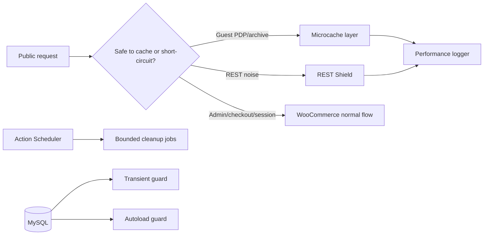

# A2 WooCommerce Performance Lab

## Overview

Public showcase for WooCommerce performance engineering patterns used around high-pressure WordPress commerce systems: microcache boundaries, REST route control, Action Scheduler cleanup, transient storm protection, autoload hygiene, and low-overhead performance diagnostics.

## Problem

The store had slow product/detail pages, expensive archive routes, heavy anonymous REST traffic, background queue pressure, and database growth from transient storms. The work needed to improve performance without breaking WooCommerce cart, checkout, logged-in sessions, Elementor rendering, or admin workflows.

## Technical Approach

- Guest-only full-page microcache with strict bypass rules for cart, checkout, sessions, logged-in users, and unsafe request methods.
- Route-aware REST shield for anonymous high-cost endpoints.
- Action Scheduler tuning and cleanup in bounded batches.
- Transient storm detection and chunked cleanup.
- Options autoload guard to reduce bootstrap memory pressure.
- Performance logger that captures route, timing, query count, and context without storing customer data.

## Key Features

- Fullpage Microcache
- REST Shield
- Action Scheduler optimization
- Transient Storm Guard
- Options Autoload Guard
- Performance logging
- LiteSpeed/WooCommerce optimization patterns

## Performance / Business Impact

- PDP TTFB: 2.3s -> 0.9s
- Archive p95: 5.2s -> 1.7s
- Action Scheduler pending queue: about 38k -> about 4.9k
- Transient rows: about 1.3M -> about 180k
- REST p95: 2.8s -> 0.9s

## Architecture

## Code Samples

- `samples/sample-mu-plugin-bootstrap.php`
- `samples/sample-cache-layer.php`
- `samples/sample-action-scheduler-cleanup.php`
- `samples/sample-performance-logger.php`

## Security & Privacy Notes

This repository contains curated samples only. Production code, credentials, private URLs, customer data, operational logs, and sensitive business rules are not included.

## Tech Stack

PHP, WordPress, WooCommerce, MySQL, REST API, Action Scheduler, WP-Cron, LiteSpeed, JavaScript.

## Related Links

- Portfolio: https://amiraliyaghouti.com
- GitHub profile: https://github.com/shiny-a2

