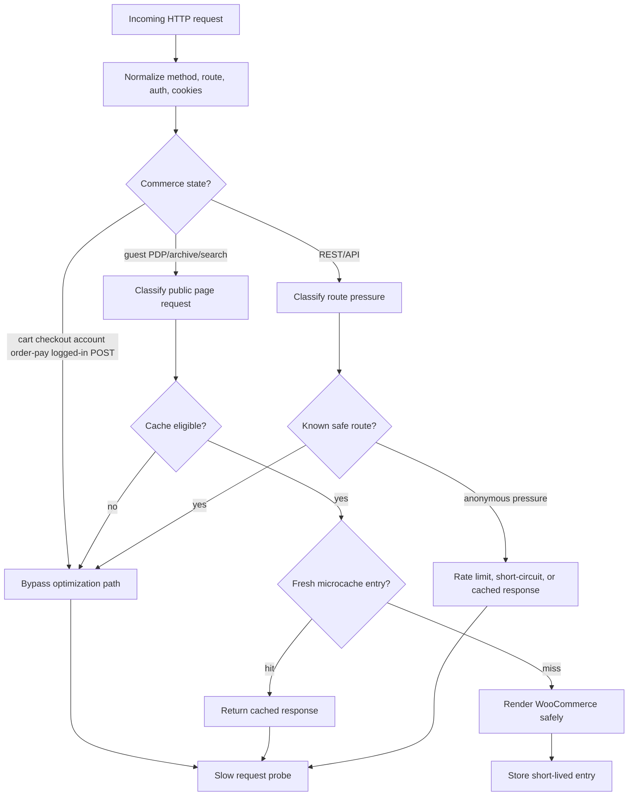

# Request Lifecycle

This showcase treats WooCommerce performance as a request-classification problem before it treats it as a caching problem.

## Path

## Operating Notes

- Cache decisions happen after request classification, not before it.
- Commerce state wins over speed. Cart, checkout, account, order payment, authenticated, and write requests bypass public-page cache behavior.
- Bot/crawler/user differentiation should be conservative. Unknown agents should not receive unsafe cached commerce responses.
- REST pressure is handled separately from page rendering because anonymous API traffic can create hidden backend load.
- External HTTP calls should fail fast on frontend paths. A slow provider should not hold the main product page request open.

## Bypass Conditions

- unsafe HTTP methods;
- logged-in or privileged requests;
- cart, checkout, account, order payment, and payment callback routes;
- nonce-sensitive admin or AJAX paths;
- requests with session/cart cookies;
- routes where private state can affect output.

